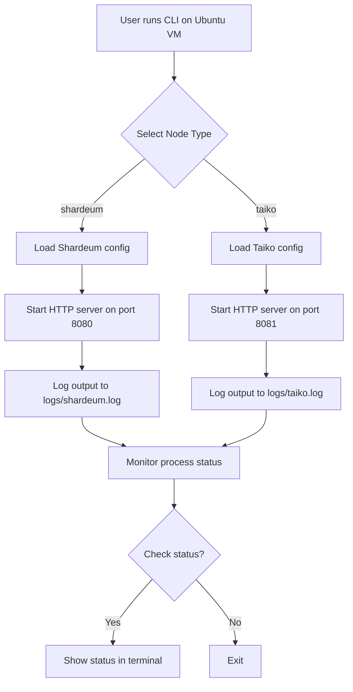

# Auto Node Deployer


[](https://www.python.org/downloads/)

A Python CLI tool to deploy and monitor blockchain testnet nodes (e.g., Shardeum, Taiko) locally. Modular, extensible, and production-ready for DevOps/Web3 infra roles. **Designed for Ubuntu-based VMs or servers.**

---

## Features
- One-command node deployment (simulated via HTTP server)
- Node status monitoring
- Logging via rich, psutil, and Python logging
- Modular config for multiple chains (YAML-driven)
- CI/CD with GitHub Actions
- Extensible for real-world node scripts

---

## Project Structure
```
auto-node-deployer/
├── auto-node-deployer.py      # Main CLI
├── config/
│   └── nodes.yaml             # Node configs
├── logs/                      # Output logs
├── node_scripts/              # Optional bash scripts
├── tests/                     # Pytest tests
├── utils/
│   └── monitor.py             # Node status checker
├── requirements.txt
├── README.md
├── LICENSE
└── .github/workflows/ci.yml   # CI config
```

---

## Workflow Diagram


---

## Setup
```bash
# For Ubuntu-based VMs/servers
sudo apt update && sudo apt install python3 python3-pip -y

# Clone and enter repo
$ git clone https://github.com/your-username/auto-node-deployer.git
$ cd auto-node-deployer

# Install dependencies
$ pip3 install -r requirements.txt
```

---

## Usage
```bash
# Deploy a node (shardeum or taiko)
python3 auto-node-deployer.py --node shardeum
python3 auto-node-deployer.py --node taiko

# Check node status
python3 auto-node-deployer.py --node shardeum --status

# Show version
python3 auto-node-deployer.py --version

# View logs
cat logs/shardeum.log
cat logs/deployer.log
```

---


---

## Roadmap
- [ ] Real blockchain node integration (not just HTTP server)
- [ ] Docker support
- [ ] Web dashboard
- [ ] More chains (Fuel, Polygon, etc)

---


---

